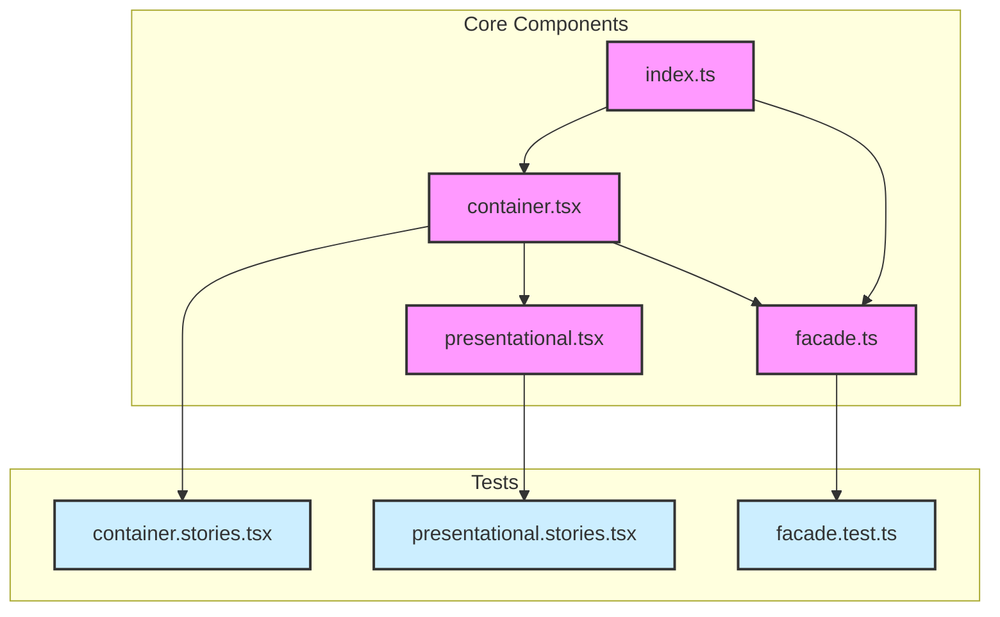

<!-- このファイルはdocs/rules以下のファイルによって自動生成されます。直接書き込むことを禁止します。編集したい場合は、docs/rules以下のファイルを編集し、scriptを実行してください。 -->

---
applyTo: "**/*.tsx"
---

# コンポーネント設計

コードを書く際のルールやガイドラインを以下に示す。これらのルールは、コードの可読性、保守性、拡張性を高めるために重要。

## コンポーネントの基本構造

コンポーネントを新しく作る場合は、以下のファイル構成に従え：

- `index.ts`
  - `container.tsx`のコンポーネントをエクスポート
  - 必要に応じて`facade.ts`の機能をエクスポート
- `container.tsx`
  - props と facade.ts の処理を利用して`presentational.tsx`を呼び出す
- `container.stories.tsx`
  - container.tsx の interaction test を実装
  - facade の処理と props の処理の統合テスト
  - presentational の UI 確認は行わない
  - play 関数を伴うコンポーネントのみ作成
  - vitest でのテスト実行と修正
- `facade.ts`
  - container.tsx が依存する処理を実装
  - React カスタムフックまたは通常の関数として実装
  - 必要に応じて定数を定義
- `facade.test.ts`
  - facade.ts の処理のテストを実装
  - vitest でのテスト実行と修正
- `presentational.tsx`
  - props を受け取って UI を表示
  - 内部でロジックを持たない
- `presentational.stories.tsx`
  - presentational.tsx の UI 確認
  - interaction test は行わない
  - props による UI 表示の確認



## スタイリングのルール

### styled-components の使用

- [styled-components](https://styled-components.com/docs)を使用しろ。
- それ以外の方法は使用するな。

```tsx
import styled from "styled-components";

const StyledButton = styled.button``;
```

### コンポーネント命名規則

- styled-components で作成したコンポーネントは`Styled`接頭辞をつけろ。
- 一般コンポーネントと区別するため。
- 例：`StyledButton`, `StyledContainer`, `StyledHeader`

### クラス名の使用制限

- 固定の`className`を指定するな。
- 上流からのスタイル上書きを防ぐため。
- 例：
  - ❌ `className="modal"`
  - ⭕️ ` const StyledModal = styled.div``;  `

### 動的スタイルの適用

再計算されるスタイルは style props を使用しろ：

#### 良い例

```tsx
const Component = () => {
  const headerRef = useRef(null);
  const [headerRefHeight, setHeaderRefHeight] = useState(0);

  useEffect(() => {
    if (!headerRef.current) return;
    const { height } = headerRef.current.getBoundingClientRect();
    setHeaderRefHeight(height);
  }, [headerRef]);

  return (
    <>
      <header ref={headerRef}>...</header>
      <StyledMain
        style={{
          marginTop: `${headerRefHeight}px`,
        }}
      >
        ...
      </StyledMain>
    </>
  );
};
```

#### 悪い例

```tsx
const Component = () => {
  const [headerRefHeight, setHeaderRefHeight] = useState(0);

  return (
    <>
      <header>...</header>
      <StyledMain margintop={headerRefHeight}>...</StyledMain>
    </>
  );
};
```

## アーキテクチャパターン

コンポーネントの設計には、以下のパターンから適切なものを選択しろ。

### Container/Presentational パターン

ロジックと UI を分離する設計パターン。コンポーネントを Container（ロジック）と Presentational（UI）の 2 つの役割に分けることで、責務を明確に分離する。

#### 構成要素

1. Container コンポーネント（container.tsx）

   - データ取得・状態管理のロジックを担当
   - API との通信やデータ加工
   - Presentational コンポーネントへのデータ提供
   - Facade の機能利用
   - ビジネスロジックのテスト実装

2. Presentational コンポーネント（presentational.tsx）
   - props を使用した UI レンダリング
   - ロジックを持たない
   - スタイリングに注力
   - 再利用可能な UI 実装
   - UI テストの実装

#### メリット

- **関心の分離**
  - ロジックと UI の明確な分離
  - コードの保守性向上
- **テスタビリティ向上**
  - 個別のテスト実施が容易
  - モック・スタブの活用
- **再利用性向上**
  - UI コンポーネントの再利用
  - 異なる Container での活用
- **開発効率向上**
  - UI/ロジック開発の分業化
  - チーム開発の円滑化

#### 使用ケース

1. データ操作と UI の責務を分離したい場合

   - フォーム処理
   - データ一覧表示
   - ダッシュボード
   - API データの表示

2. 複雑なビジネスロジックを含む場合

   - 注文処理
   - ユーザー認証
   - データ集計・分析
   - ワークフロー管理

3. UI の再利用性を高めたい場合

   - 共通コンポーネント
   - テーマ対応 UI
   - マルチプラットフォーム対応
   - 異なるデータソースでの使用

4. テスト容易性が重要な場合
   - クリティカルな機能
   - 複雑な状態管理
   - ビジネスロジックの検証
   - UI の独立したテスト

#### 実装例

シンプルなカウンターコンポーネントを例に、Container/Presentational パターンの実装方法を示す。

- presentational.tsx

```tsx
import { memo } from "react";
import styled from "styled-components";

const StyledContainer = styled.div`
  padding: 16px;
  border: 1px solid #ccc;
  border-radius: 4px;
`;

const StyledCount = styled.div`
  font-size: 24px;
  margin-bottom: 8px;
`;

const StyledButton = styled.button`
  padding: 4px 8px;
  margin: 0 4px;
`;

type Props = {
  readonly count: number;
  readonly onIncrement: () => void;
  readonly onDecrement: () => void;
};

export const Presentational = memo(function Presentational(props: Props) {
  return (
    <StyledContainer>
      <StyledCount>Count: {props.count}</StyledCount>
      <div>
        <StyledButton onClick={props.onDecrement}>-</StyledButton>
        <StyledButton onClick={props.onIncrement}>+</StyledButton>
      </div>
    </StyledContainer>
  );
});
```

- facade.ts

```tsx
import { useState } from "react";

export const useCounter = (initialValue = 0) => {
  const [count, setCount] = useState(initialValue);

  const increment = () => setCount((prev) => prev + 1);
  const decrement = () => setCount((prev) => prev - 1);

  return {
    count,
    increment,
    decrement,
  };
};
```

- container.tsx

```tsx
import { memo } from "react";
import { Presentational } from "./presentational";
import { useCounter } from "./facade";

type Props = {
  readonly initialValue?: number;
};

export const Counter = memo(function Counter(props: Props) {
  const { count, increment, decrement } = useCounter(props.initialValue);

  return (
    <Presentational
      count={count}
      onIncrement={increment}
      onDecrement={decrement}
    />
  );
});
```

### Render Props パターン

コンポーネント間でコードを共有し、UI の柔軟性を高める設計パターン。`render`または任意のプロップとして関数を渡し、その関数内でコンポーネントをレンダリングする。

#### 構成要素

1. レンダリング関数

   - コンポーネントの表示内容を定義
   - 親コンポーネントから提供
   - 表示のカスタマイズ機能

2. コンポーネント本体
   - レンダリング関数の実行
   - 共通ロジック・スタイリングの提供
   - コンテキスト・コールバック関数の提供

#### メリット

- **柔軟性**
  - 子コンポーネントのレンダリング制御
  - 再利用性の向上
- **関心の分離**
  - ロジックと表示の分離
  - 責務の明確化
- **テスタビリティ**
  - 個別テストの実施
  - モック・スタブの活用

#### 使用ケース

1. コンポーネントの表示内容のカスタマイズ

   - モーダル
   - ダイアログ
   - カード
   - リスト項目

2. 共通ロジックで異なる表示の実現

   - データフェッチング
   - ページネーション
   - フィルタリング
   - ソート機能

3. 親のコンテキスト・データの提供

   - テーマ設定
   - 認証情報
   - 多言語化
   - 設定情報

4. UI の動的な差し替え
   - 条件付きレンダリング
   - A/B テスト
   - フィーチャーフラグ
   - プラグイン機能

#### 実装例

シンプルなモーダルコンポーネントを例に、Render Props パターンの実装方法を示す。

```tsx
type Props = {
  readonly renderHeader?: () => React.ReactNode;
  readonly renderBody?: () => React.ReactNode;
  readonly renderFooter?: (props: {
    components: {
      Button: typeof StyledCloseButton;
    };
  }) => React.ReactNode;
};

export const Presentational = memo(function Presentational(props: Props) {
  return (
    <StyledContainer>
      {props.renderHeader && (
        <StyledHeader>{props.renderHeader()}</StyledHeader>
      )}
      {props.renderBody && <StyledBody>{props.renderBody()}</StyledBody>}
      {props.renderFooter && (
        <StyledFooter>
          {props.renderFooter({ components: { Button: StyledCloseButton } })}
        </StyledFooter>
      )}
    </StyledContainer>
  );
});
```

使用例：

```tsx
<Modal
  renderHeader={() => <>タイトル</>}
  renderBody={() => <>本文</>}
  renderFooter={({ components }) => (
    <components.Button onClick={onClose}>閉じる</components.Button>
  )}
/>
```

### Compound パターン

関連するコンポーネントをグループ化し、直感的な API を提供する設計パターン。親コンポーネントと子コンポーネント間で状態を共有し、密接に連携するコンポーネント群を 1 つのインターフェースとして提供する。

#### 構成要素

1. ルートコンポーネント

   - グループのコンテキスト提供
   - 共有状態の管理
   - 子コンポーネントの連携制御

2. 子コンポーネント群
   - 特定の役割を担当
   - コンテキストでの状態共有
   - 相互の連携動作
   - 単独使用も可能

#### メリット

- **直感的な API**
  - 明確な関係性
  - 自然な階層構造
- **柔軟性**
  - 配置の自由度
  - 必要な機能の選択
- **カプセル化**
  - コンポーネントのグループ化
  - 状態管理の隠蔽

#### 使用ケース

1. 関連コンポーネントのグループ化

   - タブ
   - アコーディオン
   - メニュー
   - フォームコントロール

2. 状態共有の必要性

   - 選択状態
   - 開閉状態
   - フォーカス状態
   - 入力値の同期

3. 直感的な API 提供

   - 階層構造の活用
   - セマンティックな関係性
   - コンポーネントの組み合わせ
   - カスタマイズ可能性

4. アクセシビリティ実装
   - WAI-ARIA パターン
   - キーボード操作
   - フォーカス管理
   - スクリーンリーダー対応

#### 実装例

タブコンポーネントを例に、Compound パターンの実装方法を示す。

```tsx
import { createContext, useContext, useState, memo } from "react";

type TabsContextType = {
  activeTab: string;
  setActiveTab: (id: string) => void;
};

const TabsContext = createContext<TabsContextType | undefined>(undefined);

const useTabs = () => {
  const context = useContext(TabsContext);
  if (!context) {
    throw new Error("Tabs components must be used within a Tabs component");
  }
  return context;
};

type TabsProps = {
  children: React.ReactNode;
  defaultTab?: string;
};

const TabsRoot = memo(function TabsRoot({ children, defaultTab }: TabsProps) {
  const [activeTab, setActiveTab] = useState(defaultTab || "");

  return (
    <TabsContext.Provider value={{ activeTab, setActiveTab }}>
      {children}
    </TabsContext.Provider>
  );
});

type TabListProps = {
  children: React.ReactNode;
};

const TabList = memo(function TabList({ children }: TabListProps) {
  return <div role="tablist">{children}</div>;
});

type TabProps = {
  children: React.ReactNode;
  id: string;
};

const Tab = memo(function Tab({ children, id }: TabProps) {
  const { activeTab, setActiveTab } = useTabs();

  return (
    <button
      role="tab"
      aria-selected={activeTab === id}
      onClick={() => setActiveTab(id)}
    >
      {children}
    </button>
  );
});

type TabPanelProps = {
  children: React.ReactNode;
  id: string;
};

const TabPanel = memo(function TabPanel({ children, id }: TabPanelProps) {
  const { activeTab } = useTabs();

  if (activeTab !== id) return null;

  return <div role="tabpanel">{children}</div>;
});

export const Tabs = {
  Root: TabsRoot,
  List: TabList,
  Tab: Tab,
  Panel: TabPanel,
};
```

使用例：

```tsx
<Tabs.Root defaultTab="tab1">
  <Tabs.List>
    <Tabs.Tab id="tab1">Tab 1</Tabs.Tab>
    <Tabs.Tab id="tab2">Tab 2</Tabs.Tab>
    <Tabs.Tab id="tab3">Tab 3</Tabs.Tab>
  </Tabs.List>

  <Tabs.Panel id="tab1">Content for Tab 1</Tabs.Panel>
  <Tabs.Panel id="tab2">Content for Tab 2</Tabs.Panel>
  <Tabs.Panel id="tab3">Content for Tab 3</Tabs.Panel>
</Tabs.Root>
```
